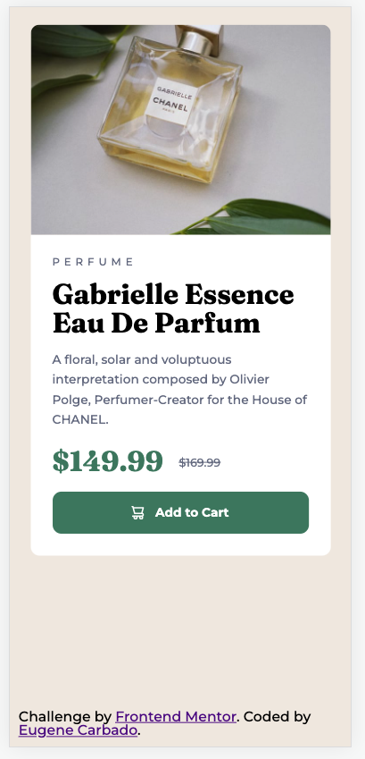
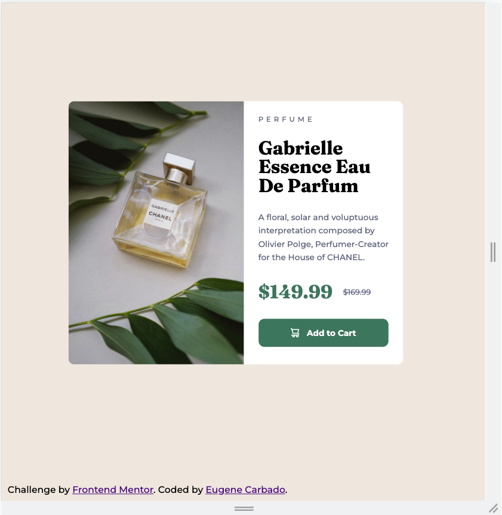

# Frontend Mentor - Product preview card component solution

This is a solution to the [Product preview card component challenge on Frontend Mentor](https://www.frontendmentor.io/challenges/product-preview-card-component-GO7UmttRfa). Frontend Mentor challenges help you improve your coding skills by building realistic projects. 

## Table of contents

- [Overview](#overview)
  - [The challenge](#the-challenge)
  - [Screenshot](#screenshot)
  - [Links](#links)
- [My process](#my-process)
  - [Built with](#built-with)
  - [What I learned](#what-i-learned)
  - [Continued development](#continued-development)
- [Author](#author)

## Overview

### The challenge

This is my solution for the Frontend Mentors challenge "Product preview card component".

Users should be able to:

- View the optimal layout depending on their device's screen size
- See hover and focus states for interactive elements

### Screenshot

### Links

- Solution URL: [Add solution URL here](https://www.frontendmentor.io/solutions/product-preview-card-component-with-plain-html-css-wzelwDziyf)
- Live Site URL: [Add live site URL here](https://product-preview-card-component-main-ten.vercel.app/)

## My process

### Built with

- Semantic HTML5 markup
- CSS custom properties
- Flexbox
- Mobile-first workflow

### What I learned

This was just a quick project to keep my html / css skills sharp as I believe in drilling the basics to help understand bigger concepts.

### Continued development

I will continue to do projects like this and gradually build up to bigger challenges to keep my skills sharp.

## Author

- Website - [Add your name here](https://eugenecarbado.dev/)
- Frontend Mentor - [@yourusername](https://www.frontendmentor.io/profile/eugenecarbado)
- Twitter - [@yourusername](https://www.twitter.com/yourusername)
